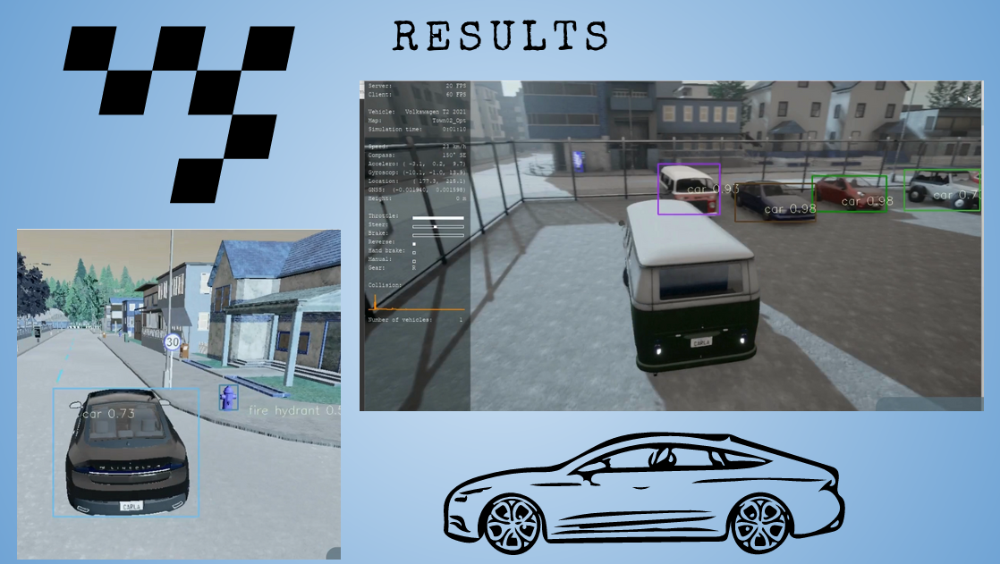

# Carla Object Detection 🚗👁️

CARLA is an open-world simulator widely used for developing and testing autonomous driving systems.  
This project integrates **YOLOv4** with the **CARLA Simulator** to perform **real-time object detection** while driving a simulated vehicle. The detected objects can later be used for dataset generation and training self-driving models.

---

## Features

- Real-time object detection using YOLOv4  
- Integration with CARLA simulator  
- Manual driving control  
- Detection of vehicles, pedestrians, and other objects  
- Useful for training and evaluation of autonomous driving models  

---

## Demo Video 🎥

Watch the project demo here:

🔗 **Google Drive Link:**  
https://drive.google.com/drive/folders/1XLZkHW4puMvjgYTs90Kjnnx9Fbyia39q?usp=sharing

---

## Screenshots 📸

